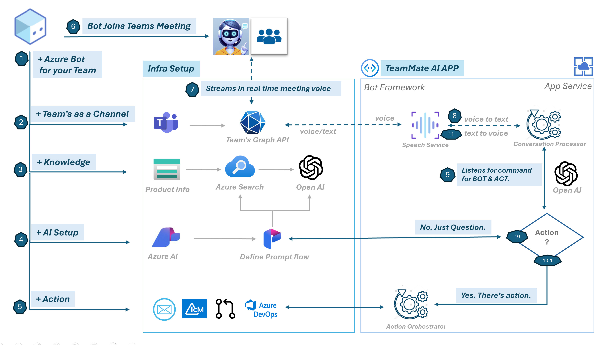

# AI Team Assistant

## Problem Statement
In today’s remote and hybrid work environments, teams often struggle with unfocused meetings, scattered discussions, and missed action items, which reduce collaboration and overall productivity. Managing large volumes of private knowledge such as source code, design documents, and meeting notes during live conversations can overwhelm team members.

## Solution
Imagine a Human-like, Voice-enabled AI assistant that feels like an integral part of your team. Personalized for each team, this assistant goes beyond typical AI tools by actively collaborating as a smart team member.

It learns from your team's unique knowledge base, such as source code, design documents, and specifications and participates in meetings through Microsoft 365 and Teams. With real-time voice interactions and task automation, it revolutionizes how teams manage information, make decisions, and streamline everyday tasks.
## Design Diagram




## Implementation using Azure Architecture

**Azure Bot Service:** Hosts the voice-enabled Teams bot, allowing it to participate in meetings.

**Graph API:** Manages communication between the Teams bot and meeting participants, facilitating both audio and text interactions.

**Azure Speech Service:** Converts meeting audio into text for analysis and transforms text into voice responses for a seamless audio experience.

**Storage Account:** Stores private project data such as documents, specifications, and notes.

**Azure Search:** Retrieves private knowledge stored in Azure Storage, including design documents, project details, and meeting notes, to support real-time decision-making.

**Azure Prompt Flow:** Adds private knowledge from documents and conversations to questions, enabling Azure OpenAI to provide context-aware responses and actions.

**Azure OpenAI:** Detects actions in conversations, extracts insights, and generates context-relevant responses based on private knowledge and meeting discussions.

## Prerequisites

### Create a PFX Certificate

The Bot requires an SSL certificate signed by a Certificate Authority. You can create a free SSL certificate as follows:

1. Ensure you can make DNS changes to your domain or purchase a new domain.
2. Install [Certbot](https://certbot.eff.org/instructions?ws=other&os=windows).
3. Open a terminal as Administrator and run:
    ```
    certbot certonly --manual --preferred-challenges=dns -d '*.example.com' --key-type rsa
    ```
4. Add the provided TXT record to your DNS.
5. Install [OpenSSL](https://slproweb.com/products/Win32OpenSSL.html) and run:
    ```
    openssl pkcs12 -export -out star_example_com.pfx -inkey privkey.pem -in cert.pem
    ```
6. Save the PFX certificate path for later use.

## Bot Registration

1. [Register a Calling Bot](https://microsoftgraph.github.io/microsoft-graph-comms-samples/docs/articles/calls/register-calling-bot.html) and note down the Bot ID, MicrosoftAppId, and MicrosoftAppPassword.
2. Add the following Application Permissions to the bot:
    - Calls.AccessMedia.All
    - Calls.JoinGroupCall.All
3. Consent to these permissions using a tenant admin account by visiting:
    ```
    https://login.microsoftonline.com/common/adminconsent?client_id=<app_id>&state=<any_number>&redirect_uri=<any_callback_url>
    ```

## How to Run Locally

1. Clone the repository.
2. Update `appsettings.json`:
    ```json
    {
	  "MicrosoftAppType": "MultiTenant",
	  "MicrosoftAppId": "<app_id>",
	  "MicrosoftAppPassword": "<secret>",
	  "MicrosoftAppTenantId": "<tenant>",
	  "AppSettings": {
		"AadAppId": "<app_id_>",
		"AadAppSecret": "<secret>",
		"ServiceDnsName": "bot.<domain.com>",
		"CertificateThumbprint": "<thumbprint>",
		"BotCallingInternalPort": 9442,
		"BotInstanceExternalPort": 443,
		"BotInternalPort": 9441,
		"MediaInstanceExternalPort": 20046,
		"MediaInternalPort": 8445,
		"ApplicationInsightsInstrumentationKey": "",
		"UseSpeechService": true,
		"SpeechConfigKey": "<speechkey>",
		"SpeechConfigRegion": "eastus",
		"BotLanguage": "en-US",
		"UseLocalDevSettings": true,
		"MediaDnsName": "tcp.<domain.com>"
	  },
	  "PromptFlow": {
		"Endpoint": "<PromptFlowEndpoint>",
		"ModelName": "<PromptFlowModelName>",
		"Secret": "<PromptFlowSecret>"
	  },
	  "AZURE_OPENAI_ENDPOINT": "https://teammateai.openai.azure.com/",
	  "AZURE_OPENAI_API_KEY": "<azure-openapi-key>",
	  "AZURE_OPENAI_MODEL": "gpt-4o-deployment",
	  "ADO_PAT": "<ado_pat>"
	}
    ```
3. Start the application in Visual Studio.

### Setup Ngrok

1. Download and install Ngrok.
2. Get the Ngrok authToken and replace it ngrok.yaml
	```
	ngrok authtoken <auth_token>
	```
3. Run the following ngrok command to create a tunnel:
	```
	ngrok.exe  start --all --config=<Path to your ngrok.yml>
	```
4. Add the Ngrok CNames in your DNS settings:
	```
	tcp.<domain.com> -> <ngrok_url>
	bot.<domain.com> -> <ngrok_url>
	```

### Testing

You can test the bot using the following cURL command:
```bash
curl --location --request POST 'https://bot.<domain.com>/Call' \
--header 'Content-Type: application/json' \
--data-raw '{ "joinURL": "https://teams.microsoft.com/l/meetup-join/..." }'
```

