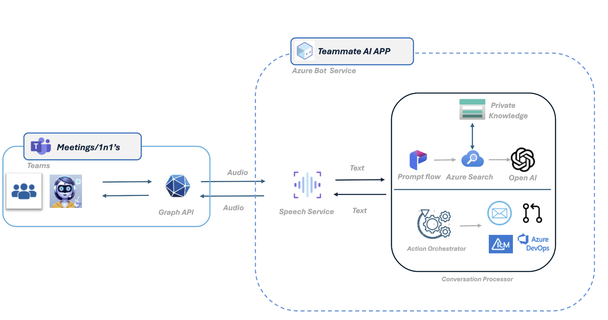

# AI Team Assistant

TeamMate AI is an intelligent assistant for Microsoft Teams, designed to enhance meetings by providing real-time insights, suggestions, and action items based on live conversations. It can access private context, such as design documents and meeting notes, to deliver relevant recommendations, making meetings more focused and productive.

## Design Diagram




## Prerequisites

### Create a PFX Certificate

The Bot requires an SSL certificate signed by a Certificate Authority. You can create a free SSL certificate as follows:

1. Ensure you can make DNS changes to your domain or purchase a new domain.
2. Install [Certbot](https://certbot.eff.org/instructions?ws=other&os=windows).
3. Open a terminal as Administrator and run:
    ```
    certbot certonly --manual --preferred-challenges=dns -d '*.example.com' --key-type rsa
    ```
4. Add the provided TXT record to your DNS.
5. Install [OpenSSL](https://slproweb.com/products/Win32OpenSSL.html) and run:
    ```
    openssl pkcs12 -export -out star_example_com.pfx -inkey privkey.pem -in cert.pem
    ```
6. Save the PFX certificate path for later use.

## Bot Registration

1. [Register a Calling Bot](https://microsoftgraph.github.io/microsoft-graph-comms-samples/docs/articles/calls/register-calling-bot.html) and note down the Bot ID, MicrosoftAppId, and MicrosoftAppPassword.
2. Add the following Application Permissions to the bot:
    - Calls.AccessMedia.All
    - Calls.JoinGroupCall.All
3. Consent to these permissions using a tenant admin account by visiting:
    ```
    https://login.microsoftonline.com/common/adminconsent?client_id=<app_id>&state=<any_number>&redirect_uri=<any_callback_url>
    ```

## How to Run Locally

1. Clone the repository.
2. Update `appsettings.json`:
    ```json
    {
	  "MicrosoftAppType": "MultiTenant",
	  "MicrosoftAppId": "<app_id>",
	  "MicrosoftAppPassword": "<secret>",
	  "MicrosoftAppTenantId": "<tenant>",
	  "AppSettings": {
		"AadAppId": "<app_id_>",
		"AadAppSecret": "<secret>",
		"ServiceDnsName": "bot.<domain.com>",
		"CertificateThumbprint": "<thumbprint>",
		"BotCallingInternalPort": 9442,
		"BotInstanceExternalPort": 443,
		"BotInternalPort": 9441,
		"MediaInstanceExternalPort": 20046,
		"MediaInternalPort": 8445,
		"ApplicationInsightsInstrumentationKey": "",
		"UseSpeechService": true,
		"SpeechConfigKey": "<speechkey>",
		"SpeechConfigRegion": "eastus",
		"BotLanguage": "en-US",
		"UseLocalDevSettings": true,
		"MediaDnsName": "tcp.<domain.com>"
	  },
	  "PromptFlow": {
		"Endpoint": "<PromptFlowEndpoint>",
		"ModelName": "<PromptFlowModelName>",
		"Secret": "<PromptFlowSecret>"
	  },
	  "AZURE_OPENAI_ENDPOINT": "https://teammateai.openai.azure.com/",
	  "AZURE_OPENAI_API_KEY": "<azure-openapi-key>",
	  "AZURE_OPENAI_MODEL": "gpt-4o-deployment",
	  "ADO_PAT": "<ado_pat>"
	}
    ```
3. Start the application in Visual Studio.

### Testing

You can test the bot using the following cURL command:
```bash
curl --location --request POST 'https://signal.ngrok.io/Call' \
--header 'Content-Type: application/json' \
--data-raw '{ "joinURL": "https://teams.microsoft.com/l/meetup-join/..." }'
```

